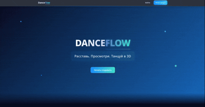
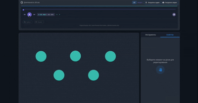
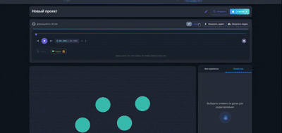
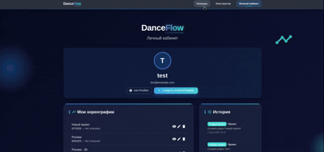
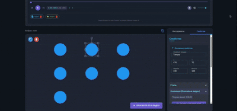

# DanceFlow

<div align="center">
  
</div>

<div align="center">
  <p style="font-size: 1.1em; max-width: 800px; margin: 0 auto; padding: 20px;">
    DanceFlow — проект, разработанный для участия в проектном конкурсе от Центрального университета. 
    Его цель — сделать процесс постановок хореографий проще и качественнее.
  </p>
</div>

## 🎯 Основные возможности

<div style="margin: 30px 0;">
  <div align="center">
    
  </div>
</div>

### 📝 Создание схем передвижений
Интуитивный конструктор для визуализации перемещений танцоров на сцене

<div align="center" style="margin: 30px 0;">
  
</div>

### 🎥 Работа с медиа-контентом
Загружайте и управляйте видео и аудио материалами ваших постановок

<div align="center" style="margin: 30px 0;">
  
</div>

### 👥 Командная работа
Удобный командный доступ к проектам

<div align="center" style="margin: 30px 0;">
  
</div>

### 🎨 3D Визуализация
Визуализируйте индивидуальные движения каждого человека в 3D

<div align="center" style="margin: 30px 0;">
  
</div>

## Технологический стек

- **Frontend:**
  - React.js (18+)
  - Material-UI (MUI)
  - Three.js (3D-визуализация)
  - @react-three/fiber, @react-three/drei
  - Cypress (e2e тесты)
  - Jest, React Testing Library (юнит- и интеграционные тесты)
- **Сервер авторизации и API:**
  - Go (микросервисы, REST API)
  - MongoDB (база данных)
  - Тесты: Go testing, Postman/Newman (API)
- **Модуль видеоанализа:**
  - Python 3.9+
  - FastAPI
  - OpenCV, MediaPipe (анализ видео и определение движений)
  - NumPy (обработка данных)

## Работа тестов

В проекте реализовано комплексное тестирование всех ключевых компонентов:

- **Frontend (client):**

  - Модульные и интеграционные тесты компонентов на Jest и React Testing Library (`client/`, `tests/jest/unit/`).
  - End-to-end тесты пользовательских сценариев на Cypress (`tests/jest/e2e/`).
  - Запуск: `cd client && npm test` (юнит/интеграция), Cypress — через отдельный runner.

- **Go-сервисы:**

  - Модульные, интеграционные и e2e тесты с использованием стандартного пакета `testing` (`tests/go/`).
  - Запуск: `cd tests/go && go test ./...`

- **API тесты:**
  - Коллекции Postman для проверки REST API (`tests/postman/collections/`).
  - Автоматизация через Newman: `cd tests/postman && newman run collections/api-tests.json`

Подробнее о структуре и стандартах тестирования — в [tests/README.md](tests/README.md).

## Локальный запуск проекта

### 1. Клонируйте репозиторий и перейдите в папку проекта

```bash
git clone https://github.com/kktjss/dance-flow
cd dance-flow
```

### 2. Установите зависимости для фронтенда

```bash
cd client
npm install
```

### 3. Установите Go и зависимости для серверной части

- Убедитесь, что у вас установлен Go 1.20+  
  Проверьте командой: `go version`
- Установите зависимости:

```bash
cd ../server/go
go mod download
```

### 4. Настройте Python-сервис видеоанализа

```bash
cd server/python
# Создание виртуального окружения
python -m venv venv
# Активация виртуального окружения
source venv/bin/activate  # Linux/Mac
# Установка зависимостей
pip install -r requirements.txt
```

### 4. Запустите серверную часть (Go API) и Python-сервис

```bash
cd server
./start_servers.sh
```

Python-сервис будет доступен на `http://localhost:8000`
Go API-сервер будет доступен на `http://localhost:5000`

### 6. Запустите фронтенд

В новом терминале:

```bash
cd client
npm start
```

Фронтенд будет доступен на `http://localhost:3000`

---

**Примечания:**

- Для корректной работы фронтенда должен быть запущен Go API-сервер на 5000 порту.
- Для работы с базой данных требуется запущенный MongoDB (см. документацию по настройке).
- Для полнофункциональной работы с видеоанализом требуется запущенный Python-сервис.
